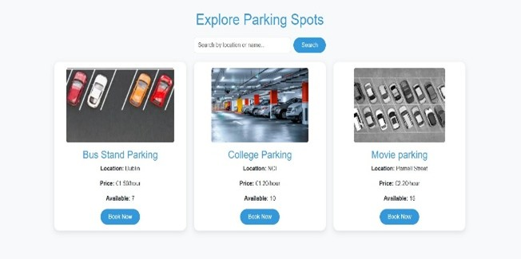
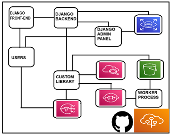
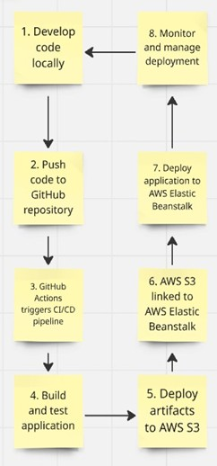
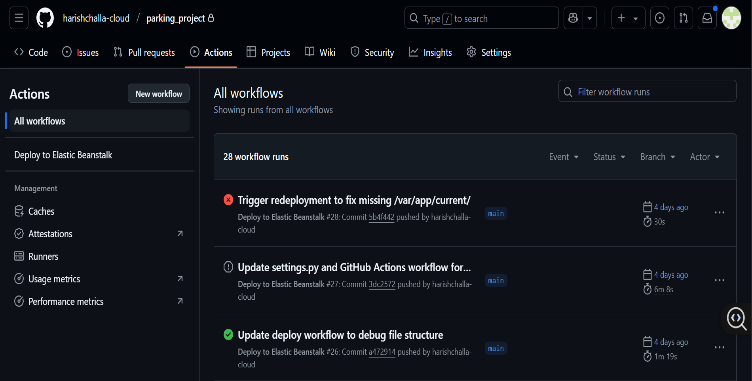
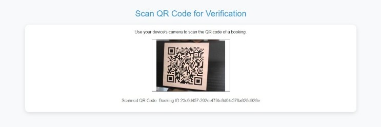
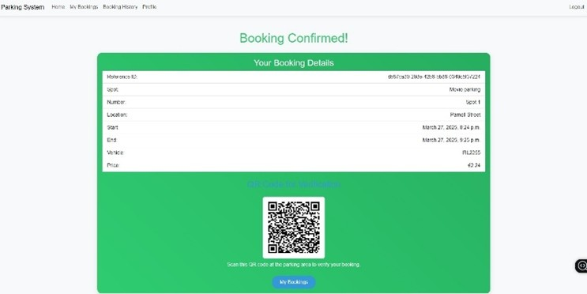

# Parking Management Application

A **cloud-native Django web application** enabling users to search, book, and manage parking spots with ease—integrating AWS services, modular utilities, and CI/CD automation for seamless operations.

---

## Table of Contents

- [Project Overview](#project-overview)
- [Features](#features)
- [Screenshots](#screenshots)
- [Architecture](#architecture)
- [AWS Service Choices](#aws-service-choices)
- [CI/CD Pipeline](#cicd-pipeline)
- [Custom Python Library](#custom-python-library)
- [Project Structure](#project-structure)
- [Getting Started](#getting-started)
- [Learnings & Reflection](#learnings--reflection)
- [References](#references)

---

## Project Overview

This project delivers a **smart parking management platform** for both end-users and administrators:

- **Users:**  
  - Search, view, and book available parking spots.
  - Receive confirmation, QR codes for booking validation, and manage all bookings via a friendly web interface.

- **Admins:**  
  - Manage all parking spots and bookings (CRUD interface).
  - Scan/verify booking QR codes on user arrival.
  - Receive automated updates and system monitoring with minimal manual oversight.

The backend leverages [Django](https://www.djangoproject.com/), while AWS hosts data, files, async tasks, notifications, logs, and deployment.

---

## Features

- **User Auth & Registration:** Secure signup/login for users, admin panel for superusers.
- **Parking Search & Book:** Search spots by name or location, see real-time availability, and make reservations.
- **Booking Confirmation + QR Verification:** Every booking gets a unique QR code for easy and secure spot verification.
- **Admin Panel:** Manage parking spots, bookings, and validations with a clean UI and CRUD features.
- **Automated Email Notifications:** Users/admins receive email updates via Amazon SNS.
- **Robust AWS Integration:** Uses S3 (file/media), RDS (relational data), SQS (task queue), SNS (notifications), CloudWatch (logging), Elastic Beanstalk (deployment).
- **CI/CD Pipeline:** Automated integration, testing, and deployment with GitHub Actions → Elastic Beanstalk.

---

## Screenshots

### User Experience

| Parking Spot Explorer            | Login                        | Registration                   |
|----------------------------------|------------------------------|-------------------------------|
|  |  |  |

### Administrator & Booking Flow

| Architecture Diagram          | CI/CD Workflow                |
|------------------------------|-------------------------------|
|  |  |

| GitHub Actions Dashboard      | QR Scan for Verification      | Booking Confirmation with QR   |
|------------------------------|-------------------------------|-------------------------------|
|  |  |  |

---

## Architecture

- **Frontend:** Django Templates (HTML/CSS/JS)
- **Backend:** Django RESTful APIs for booking, spot management, and user handling.
- **Modular Cloud Util Library:** [parking-utils-aec](https://test.pypi.org/project/parking-utils-aec/) (handles S3, SNS, SQS, image and QR code logic)
- **AWS-Managed Services:** RDS (MySQL), S3, SNS, SQS, CloudWatch, Elastic Beanstalk

**[See the full diagram above.](#screenshots)**

---

## AWS Service Choices

- **RDS (MySQL):** Relational, transactional, normalized data—chosen for strong integrity and model support.
- **S3:** Secure, high-availability storage of all images and QR codes, using pre-signed URLs for speed/privilege.
- **SNS:** Push emails for user and admin notifications (confirmation, reminders, status updates).
- **SQS:** Asynchronous queueing of QR code generation so booking is instant and QR is created in the background.
- **CloudWatch:** Centralized event logging and health monitoring (error tracking, metrics, alerts).
- **Elastic Beanstalk:** Scalable Django deployment, integrated with CI/CD for zero-downtime releases.

---

## CI/CD Pipeline

**Fully automated deployment using GitHub Actions and AWS Elastic Beanstalk:**


- **Push code to GitHub → GitHub Actions triggers pipeline**
- **Builds/tests Django app**
- **Deploys to Elastic Beanstalk**
- **Artifacts and static/media files pushed to S3**
- **Automatic error/status reporting and monitoring**


You can explore or adapt `.github/workflows/deploy.yml` for your own AWS deployments!

---

## Custom Python Library

**[parking-utils-aec](https://test.pypi.org/project/parking-utils-aec/):**
- Wraps common AWS services/tasks (S3 image upload, notification via SNS, QR code async creation via SQS, logging via CloudWatch)
- Used across multiple Django views/models to keep code DRY, testable, and scalable
- Published to Test PyPI for academic/professional showcase

---

## Project Structure

```plaintext
/                  # (repo root)
├── manage.py
├── requirements.txt
├── .env.example
├── .gitignore
├── docs/
│   ├── README.md   # Scaffold for images, architecture diagrams, docs
│   └── images/
├── parking/        # Main Django app (models, views, admin, templates, static)
├── parking_project/ # Django project-level config
├── .github/
│   └── workflows/deploy.yml   # CI/CD pipeline config
├── staticfiles/    # Static assets (collected for deployment)
```
*See `/docs/` for placement of images, diagrams, and further technical docs.*

---

## Getting Started

1. **Clone Repo & Set Up Environment**
    ```sh
    git clone https://github.com/harishchalla-cloud/parking_project.git
    cd parking_project
    python -m venv venv
    source venv/bin/activate    # On Windows: venv\Scripts\activate
    pip install -r requirements.txt
    ```

2. **Configure AWS/Django Variables**
    - Copy `.env.example` to `.env`, enter your credentials, keys, and endpoints.

3. **Migrate Database & Run**
    ```sh
    python manage.py migrate
    python manage.py runserver
    ```

4. **Provision AWS (for prod deployment)**
    - Set up S3, RDS, SNS, SQS, and AWS credentials as described in `/docs/`.

---

## Learnings & Reflection

> “Building this application deepened my expertise in Django, AWS services, and end-to-end CI/CD. I learned the value of modular code and modern DevOps, as well as the practicalities of deploying real projects in the cloud.”
> — Harish Challa

---

## References & Further Reading

- [Deploying Django on AWS Elastic Beanstalk](https://docs.aws.amazon.com/elasticbeanstalk/latest/dg/create-deploy-python-django.html)
- [AWS Elastic Beanstalk + Django Example](https://github.com/aws-samples/eb-django-sample)
- [parking-utils-aec Library on Test PyPI](https://test.pypi.org/project/parking-utils-aec/)

---

**For any project-related queries, feel free to reach out via [LinkedIn](https://www.linkedin.com/) or open an issue in the repository.**
